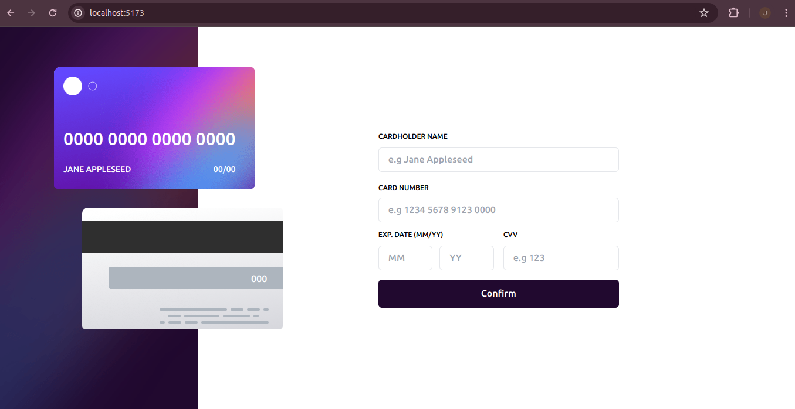
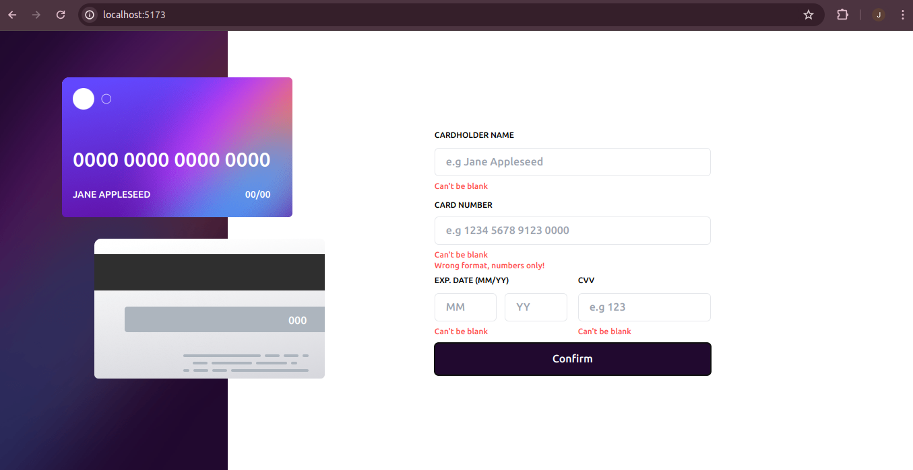
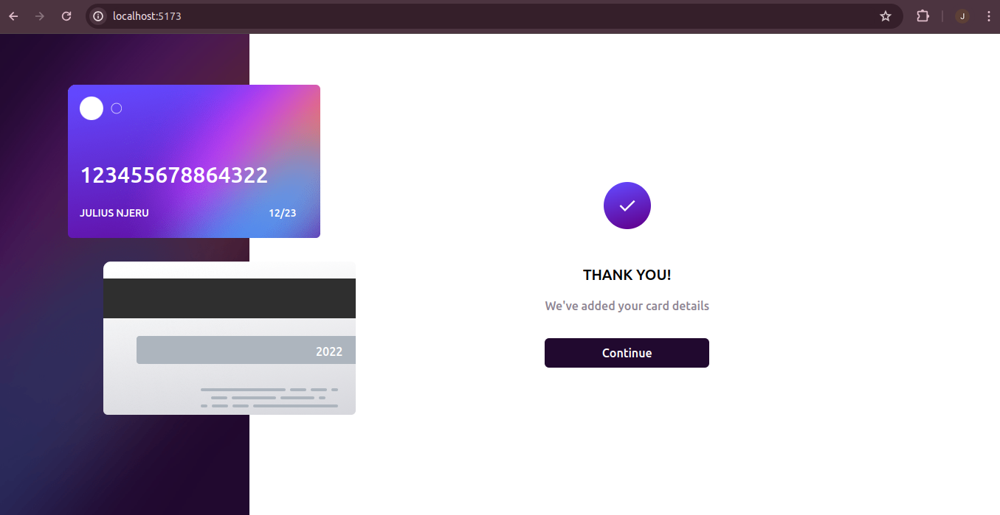
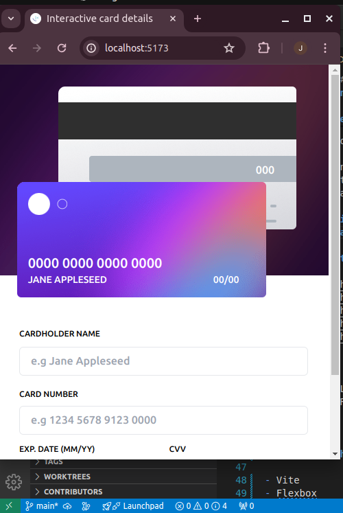

# Frontend Mentor - Interactive card details form solution

This is a solution to the [Interactive card details form challenge on Frontend Mentor](https://www.frontendmentor.io/challenges/interactive-card-details-form-XpS8cKZDWw). Frontend Mentor challenges help you improve your coding skills by building realistic projects.

## Table of contents

- [Overview](#overview)
  - [The challenge](#the-challenge)
  - [Screenshot](#screenshot)
  - [Links](#links)
- [My process](#my-process)
  - [Built with](#built-with)
  - [Continued development](#continued-development)
- [Author](#author)

## Overview

### The challenge

Users should be able to:

- Fill in the form and see the card details update in real-time
- Receive error messages when the form is submitted if:
  - Any input field is empty
  - The card number, expiry date, or CVC fields are in the wrong format
- View the optimal layout depending on their device's screen size
- See hover, active, and focus states for interactive elements on the page

##### validation of the forms is not yet complete. If you are using this project for personal purposes, please ensure that you handle validation errors

### Screenshot

### Links

- Solution URL: [https://github.com/njeruthuo/Interactive-card-details](https://github.com/njeruthuo/Interactive-card-details)
- Live Site URL: [https://interactive-card-details-seven-gold.vercel.app/](https://interactive-card-details-seven-gold.vercel.app/)

## My process

### Built with

- Vite
- Flexbox
- CSS Grid
- TailwindCSS
- CSS custom properties
- Mobile-first workflow
- [React](https://reactjs.org/) - JS library

### Continued development

This project is subject to continued development if you have any ideas on how to make it better. Otherwise, that's it for now.

## Author

- Website - [https://frontend-portfolio-amber.vercel.app/](https://frontend-portfolio-amber.vercel.app/)
- Frontend Mentor - [@njeruthuo](https://www.frontendmentor.io/profile/njeruthuo)
- Twitter - [@njeru19_njeru](https://www.twitter.com/njeru19_njeru)
